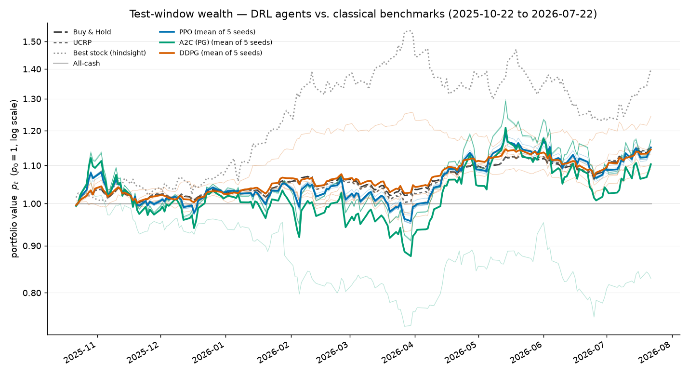
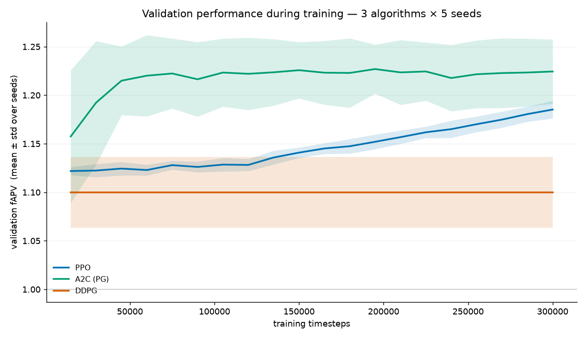

# Deep Reinforcement Learning for Portfolio Management

Comparison of **PPO**, **DDPG** and **PG (A2C)** on S&P 500 equities for
continuous multi-asset portfolio allocation.

Environment and formalism follow **Jiang, Xu & Liang (2017)**, arXiv:1706.10059v1.
The three-algorithm comparison follows **Liang et al. (2018)**, arXiv:1808.09940v3.

Final-year CS thesis

---

## 1. Headline finding

**All 15 trained agents collapsed to a constant portfolio.** Each one outputs the
same weight vector on every trading day and ignores the price tensor entirely.

Measured over the 187-day test window (`experiments/policy_diagnostic.py`):

| Algorithm | Largest movement of any weight, whole window | Verdict |
|---|---|---|
| PPO | 4.1e-07 – 1.3e-06 | constant |
| A2C (PG) | 2.7e-08 – 4.1e-07 | constant |
| DDPG | exactly 0.0 | constant |

A trading policy moves weights by O(0.1). These move by float32 rounding error.
The result holds on a harder control too: observations from non-overlapping
market regimes (start/middle/end of each split) produce the same weights.

**Consequence:** the reported fAPV differences are differences between *constant
portfolios*, not between trading strategies. The thesis is a negative result, and
that is the honest contribution.

DDPG is the most extreme case: its actor saturated at the action bounds
(every output exactly ±10), froze before the first evaluation at 15k steps, and
its validation score is bit-identical across all 20 evaluations to 300k.

This matches the failure Liang et al. report independently on Chinese equities:
*"the degeneration of our reinforcement learning agent, which often tends to buy
only one asset at a time."*

---

## 2. Setup

Python 3.10+ (developed on 3.12.10, CPU only).

```bash
python -m venv .venv
.venv\Scripts\Activate.ps1        # Windows PowerShell
python -m pip install -r requirements.txt
```

Reproduce everything with one command:

```bash
python experiments/run_all.py                 # full: retrains, ~6-7 h on CPU
python experiments/run_all.py --skip-train    # results only, ~1 min
```

Verified stack: torch 2.13.0+cpu · stable-baselines3 2.9.0 · gymnasium 1.0.0 ·
numpy 1.26.4 · pandas 2.3.3 · yfinance 1.5.2 · matplotlib 3.11.1.

---

## 3. Data

**Universe (fixed, approved):** AAPL, MSFT, JPM, JNJ, XOM, PG, AMZN, NVDA + cash
(m + 1 = 9). Chosen for liquidity, which is what Jiang's zero-slippage and
zero-market-impact hypotheses (§2.4) require.

**Window:** 2021-07-23 → 2026-07-22, 1254 trading days. Daily adjusted OHLC.

**Survivorship:** the list is fixed as of the *start* of the window and held
constant, per Jiang §3.1. No forward-looking selection.

---

## 4. Experimental design

**Chronological split, never shuffled.** The test window was touched exactly once.

| Split | Dates | Days | Decision steps | Role |
|---|---|---|---|---|
| Train | 2021-07-23 → 2025-01-21 | 878 | 828 | training |
| Validation | 2025-01-22 → 2025-10-20 | 188 | 187 | checkpoint selection + tuning |
| **Test** | 2025-10-21 → 2026-07-22 | 188 | 187 | **held out, evaluated once** |

**Protocol:** 300,000 timesteps per seed, 5 seeds per algorithm, equal budget for
all three. Commission 0.25% both sides (Jiang's own default). Best-on-validation
checkpointing. Agents evaluated deterministically.

**Metrics (Jiang §6.2):** fAPV · annualized Sharpe · maximum drawdown · turnover.
Note our Sharpe is annualized (×√252); Jiang's Eq. 28 is not, so the numbers are
not directly comparable to his table.

---

## 5. Results — all three periods

Agents show mean ± std over 5 seeds. Benchmarks are deterministic.

### 5.1 Train (in-sample, 828 steps)

| Strategy | fAPV | Annualized | Sharpe | Max drawdown |
|---|---|---|---|---|
| PPO | 3.5585 ± 0.2512 | 47.09% | 1.326 | 45.20% |
| A2C (PG) | **5.6436 ± 2.0202** | **66.54%** | 1.239 | 60.39% |
| DDPG | 1.9846 ± 0.4795 | 22.54% | 1.069 | 25.83% |
| Buy & Hold | 2.1672 | 26.54% | 1.258 | 22.51% |
| UCRP | 1.9315 | 22.18% | 1.163 | 23.78% |
| Best stock (NVDA, hindsight) | 6.7847 | 79.09% | 1.327 | 66.34% |

### 5.2 Validation (used for checkpoint selection, 187 steps)

| Strategy | fAPV | Annualized | Sharpe | Max drawdown |
|---|---|---|---|---|
| PPO | 1.1852 ± 0.0091 | 25.73% | 0.874 | 24.25% |
| A2C (PG) | **1.2280 ± 0.0258** | **31.91%** | 0.849 | 32.83% |
| DDPG | 1.0998 ± 0.0365 | 13.69% | 0.833 | 17.20% |
| Buy & Hold | 1.1266 | 17.43% | 0.951 | 17.37% |
| UCRP | 1.1376 | 18.98% | 0.976 | 17.67% |
| Best stock (JNJ, hindsight) | 1.3623 | 51.68% | 2.165 | 12.73% |

### 5.3 Test (held out, evaluated once, 187 steps)

| Strategy | fAPV | Annualized | Sharpe | Max drawdown | Turnover |
|---|---|---|---|---|---|
| PPO | 1.1507 ± 0.0108 | 20.83% | 1.003 ± 0.092 | 11.64% | 0.0208 |
| A2C (PG) | 1.1033 ± 0.1532 | 14.60% | 0.451 ± 0.697 | 21.93% | 0.0128 |
| DDPG | 1.1450 ± 0.0603 | 20.08% | 1.464 ± 0.702 | 9.93% | 0.0200 |
| **Buy & Hold** | 1.1506 | 20.81% | **1.852** | **5.64%** | 0.0107 |
| **UCRP** | **1.1532** | **21.18%** | 1.793 | 6.04% | 0.0226 |
| Best stock (XOM, hindsight) | 1.3975 | 56.99% | 1.811 | 20.11% | 0.0107 |
| All-cash | 1.0000 | 0.00% | n/a | 0.00% | 0.0000 |

### 5.4 The progression

Annualized return, agents versus the best passive benchmark:

| | Train | Validation | Test |
|---|---|---|---|
| PPO | 47.09% | 25.73% | 20.83% |
| A2C (PG) | 66.54% | 31.91% | 14.60% |
| DDPG | 22.54% | 13.69% | 20.08% |
| Best benchmark | 26.54% | 18.98% | **21.18%** |
| **Agents beat benchmarks?** | yes | yes | **no** |

The agents beat the benchmarks on both in-sample windows and lose on the held-out
window. A2C degrades most (66.5% → 31.9% → 14.6%), and it is the agent that
concentrated hardest: its median seed holds ~100% NVDA, the best stock of the
*training* window. The agents did not learn to trade; they learned the
historically best fixed allocation, which did not persist.

### 5.5 Figures

| Figure | File |
|---|---|
| Test wealth curves vs benchmarks | `results/evaluation/test/01_wealth_curves.png` |
| Test allocation heatmaps (flat lines = constant policy) | `results/evaluation/test/02_allocation_heatmaps.png` |
| Test per-seed spread | `results/evaluation/test/03_seed_distributions.png` |
| **Validation performance during training** | `results/evaluation/training_curves.png` |
| Train-window equivalents | `results/evaluation/train/` |
| Validation-window equivalents | `results/evaluation/val/` |
| Data checks (prices, tensor, normalization) | `results/data_checks/` |





---

## 6. Convergence — PPO did not plateau

From `experiments/plot_training.py`, slope of the validation curve over its final
third, in fAPV per 100k steps:

| Algorithm | Final validation fAPV | Slope /100k | Verdict |
|---|---|---|---|
| **PPO** | 1.1852 | **+0.0321** | **still rising — undertrained at 300k** |
| A2C (PG) | 1.2244 | +0.0035 | plateaued (by ~45k steps) |
| DDPG | 1.0998 | −0.0000 | plateaued (frozen from the start) |

**PPO is the algorithm that had not plateaued.** Confirmed by a supplementary
500k run on Colab: PPO reached validation **1.2154 ± 0.0074** at 500k, versus
**1.185 ± 0.008** at 300k — a non-overlapping improvement (worst 500k seed 1.203
beats the best 300k seed 1.196).

The head-to-head still uses **300k for all three algorithms**, because an equal
step budget is the defensible protocol. The 500k result is reported as a
supplementary finding, not part of the comparison. A2C and DDPG were not run at
500k: both had plateaued, so it would not change the ranking.

---

## 7. Conclusions

1. **No agent beats the passive benchmarks out of sample.** On test, UCRP (1.1532)
   and Buy & Hold (1.1506) match or beat every agent on fAPV, and beat all three
   decisively on Sharpe (1.79–1.85 vs 0.45–1.46) and drawdown (5.6–6.0% vs
   9.9–21.9%). The agents reach a similar return by taking more risk.
2. **The policies are degenerate.** All 15 emit a constant allocation and ignore
   the market observation. This is the central finding and it explains the rest.
3. **Validation ranking did not survive.** Validation said A2C > PPO > DDPG; test
   said PPO ≈ DDPG > A2C. This is why the split was held out.
4. **Seed variance dominates the differences between algorithms.** A2C seed 1
   collapses to fAPV 0.8293 while its other four sit near 1.17. PPO is the most
   stable. Single-seed results would have been meaningless.
5. **PPO was undertrained at the equal budget** (§6) — the one caveat on the
   ranking.

### Why the collapse is plausible (hypotheses, not yet tested)

* **The price tensor reaches the network as an unstructured vector.** SB3's
  `MultiInputPolicy` applies a CNN only to *image* observations; everything else
  it flattens. So the `(3, 50, 8)` tensor becomes 1200 loose numbers,
  concatenated with the 9 previous weights into a 1209-dim vector feeding a
  64-unit MLP — `Linear(1209, 64) → Tanh → Linear(64, 64) → Tanh`, read off the
  trained checkpoints. **There is no convolution in the models.** Everything Eq.
  18 encodes about days, assets and channels is discarded at the flatten. This
  is what EIIE exists to prevent.
* **Input scale.** After Jiang's Eq. 18 normalization every input sits at
  0.988 ± 0.092 — a near-constant signal with no zero-centering. A default SB3
  MLP sees almost no variation to key on. No observation normalization
  (`VecNormalize`) was used. With the point above, the first layer gets 1209
  inputs that are nearly all the same number.
* **Reward signal-to-noise.** Daily log returns have mean 6.7e-04 against std
  0.0191, a per-step SNR of ~0.035. The gradient is roughly 97% noise.
* **Given that SNR, a fixed diversified allocation is a rational local optimum** —
  the agents may have found the best available answer to an unlearnable problem.
* **DDPG additionally saturated** its tanh actor against the ±10 action bounds,
  which zeroes the gradient and freezes the policy permanently.

### Recommended next steps

1. **Replace the flattening feature extractor** with a convolutional or
   EIIE-style one. Two independent lines of evidence point here: our own
   architecture trace (no convolution; structure discarded), and Liang et al.,
   whose winning "PG" *is* Jiang's EIIE architecture rather than a generic policy
   gradient — so their result that PG beats PPO and DDPG may be reporting the
   architecture, not the algorithm. This is the best-motivated single change.
2. Add observation normalization and re-run one algorithm — the cheapest test of
   the input-scale hypothesis.
3. Reduce DDPG's action bounds (±10 → ±3) to prevent actor saturation.

---

## 8. Where everything is

### Documents

| Path | Contents |
|---|---|
| `docs/METHODOLOGY.md` | Thesis-chapter reference: code ↔ Jiang equation map, full specs, deviations, limitations, references |
| `results/evaluation/test/RESULTS.md` | Test-window results, full tables + per-seed detail |
| `results/evaluation/val/RESULTS.md` | Validation-window results |
| `results/evaluation/train/RESULTS.md` | Train-window results |

### Code

| Path | Purpose |
|---|---|
| `data/data_loader.py` | Download, clean, split, Jiang Eq. 18 tensor. `_download_raw` is the only provider-specific function |
| `env/portfolio_env.py` | Gymnasium environment implementing Jiang's formalism |
| `tests/test_env.py` | 7 unit tests, all passing |
| `experiments/train.py` | Training CLI (`--algo --seed --steps`) |
| `experiments/evaluate.py` | Evaluation + benchmarks (`--split train\|val\|test`) |
| `experiments/plot_training.py` | Validation curves + convergence check |
| `experiments/policy_diagnostic.py` | **Constant-policy diagnostic (§1)** |
| `experiments/run_all.py` | One-command reproduction |

### Data and artefacts

| Path | Contents |
|---|---|
| `data/raw/` | Cached per-ticker CSVs — experiments never re-download |
| `results/evaluation/{test,val,train}/` | Results table, per-seed CSV and three figures per window |
| `results/evaluation/training_curves.png` | Validation performance during training |
| `results/data_checks/` | Data sanity figures (prices, tensor, normalization) |
| `results/models/{algo}/seed{n}/` | Checkpoints, `config.json` run record, validation curve |
| `results/tensorboard/` | Training logs |
| `1706.10059.pdf` | Jiang et al. (2017) — environment and formalism |
| `1808.09940v3.pdf` | Liang et al. (2018) — the three-algorithm comparison |

---

## 9. Open items for your decision

1. **Data source** — yfinance vs the Microsoft source you recommended (§3).
   One function to change; invalidates the trained checkpoints.
2. **PG → A2C substitution** — SB3 has no bare REINFORCE, so A2C stands in as the
   vanilla policy-gradient baseline. It is labelled "A2C (PG)" throughout. This
   is the one substitution that weakens the direct comparison with Liang et al.,
   whose headline result is specifically about PG.
3. **Scope of remaining work** — whether to pursue the diagnostic follow-ups in
   §7 before the defence, or report the negative result as it stands.

### Verification status

All environment unit tests pass (7/7). Benchmark cost accounting was checked
against closed-form values at zero commission and agrees to 1.7e-13. Every Jiang
equation number cited in the code was verified against the source PDF. The test
window was evaluated exactly once.
